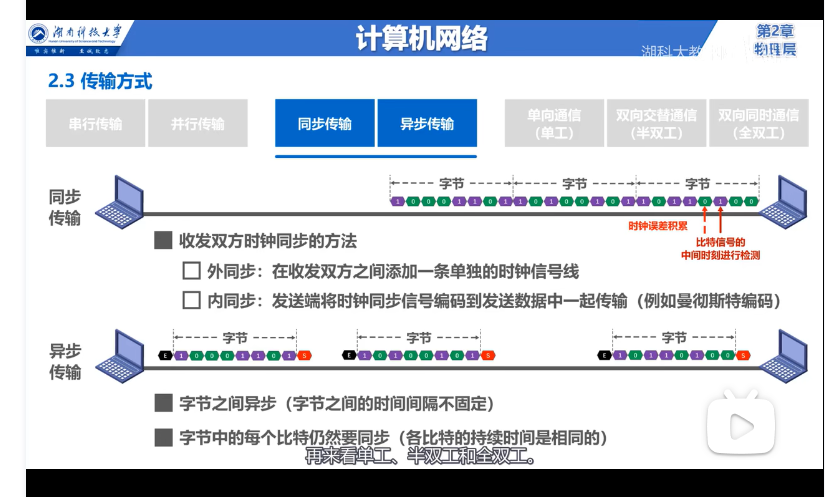
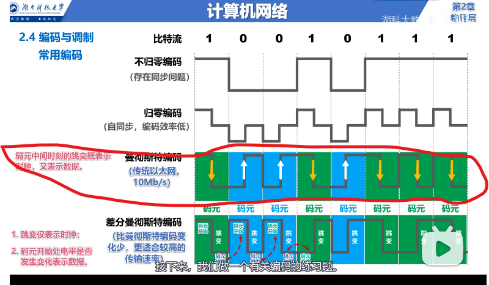
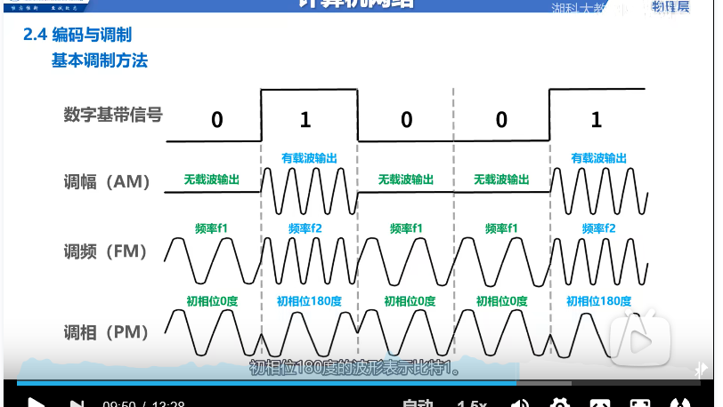
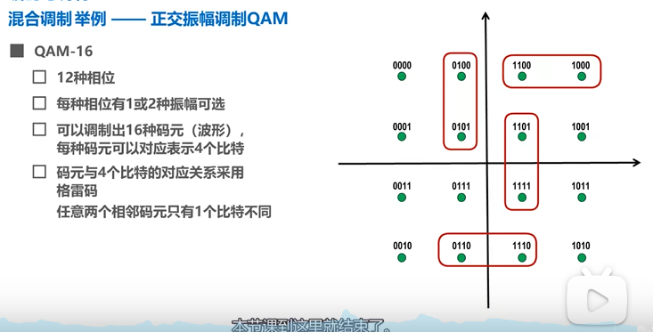
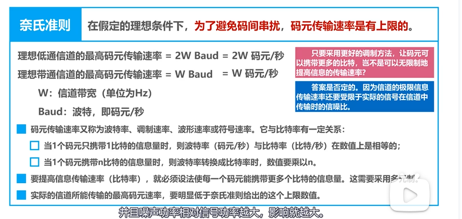
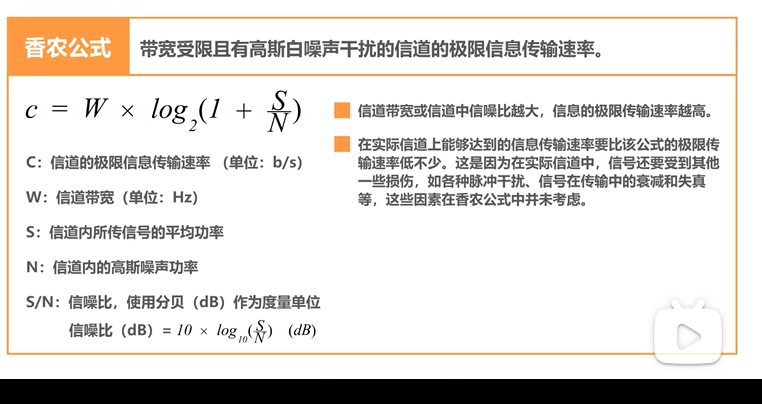

# 1210 物理层

## 1.1 物理层基本概念

1. **传输媒体：**
   - 导引型（电磁波被导引着沿着固体媒体传播）：双绞线，同轴电缆，**光纤**，电力线
   - 非导引型（电磁波在 **自由空间 **中传播）：**微波通信**，无线电波等
2. **物理层功能：**怎样才能在连接各种计算机的传输媒体上传输数据比特流bitstream，为数据链路层屏蔽了各种传输媒体的差异。

## 1.2 物理层下的传输媒体

### 1.2.1 光纤

1. 优点：

   - 通信容量大。
   - 传输损耗小
   - 抗雷电和电磁干扰性能好，在大电流脉冲干扰的环境下非常优良。
   - 保密性好，无串音干扰
   - 体积小重量轻。

2. 缺点：

   - 割接需要专业的设备。
   - 光电接口价格昂贵。

3. 光在光纤中传输的基本原理：光在纤芯中传输的方式是进行不断的 **全反射**。

   

4. 多模光纤，**单模光纤：纤芯直径等于光的一个波长，无色散，损耗小**

### 1.2.2 微波通信

微波在空间中直线传播，因此为了适应曲面道路上的传播，需要采用以下两种传播方式：

1. 卫星通信
2. 地面接力通信（继电器）

## 1.3 物理层传输方式

1. 第一种分类方式：**串行传输**（远距离传输，计算机网络采用这种传输方式），并行传输（计算机内部采用，成本高，不适合远距离传输）。
2. 第二种分类方式：**同步传输**（外同步时钟线，内同步将时钟信息编码入数据中，例如以太网的曼彻斯特编码），**异步传输**（字节间异步，比特间仍然是同步的，在每个字节添加起始位和结束位）。
3. 第三种：单向通信（单工）例如无线电广播，双向交替通信（半双工）例如对讲机，双向同时通信（全双工）例如电话。

## 1.4 物理层 编码与调制

1. 常用编码： 编码即将 **模拟/数字信号**-----> **数字信号**，在数字信道中传输。 

   

2. 常用调制：

   

混合调制：QAM 正交振幅调制

​	

## 1.5 信道的极限容量

1. 奈氏准则：

   

2. 香农公式：信道带宽或信噪比越大，信道的极限传输速率越高。

   

3. 综合来看：**尽量提高信道带宽，采用多元制（更好的调制方法）和努力提高信道中的信噪比---->信道的极限传输速率越高。**