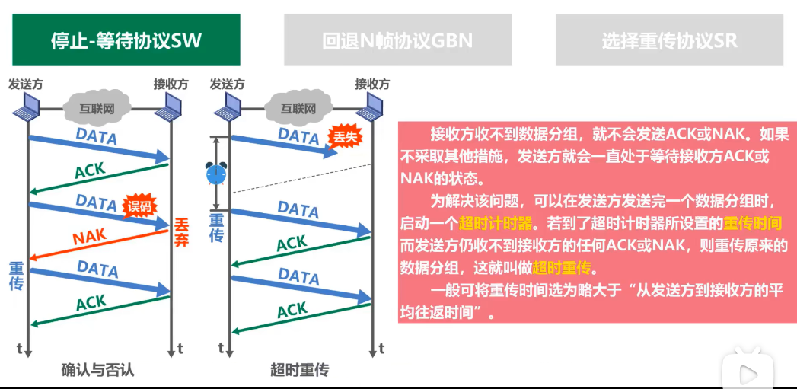
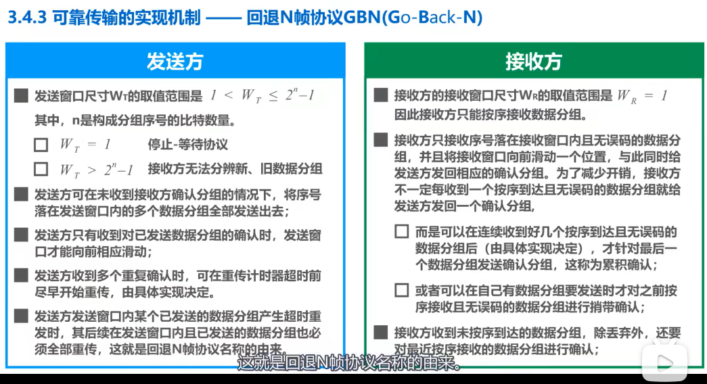
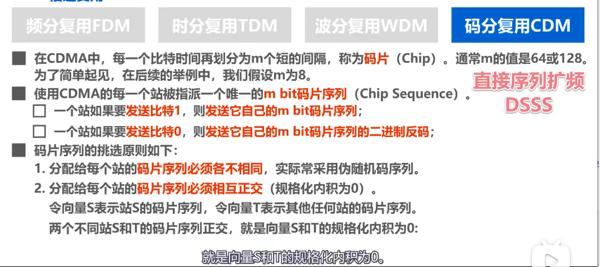

# 1210数据链路层

## 2.1 数据链路层的概述

1. 链路：从一个 **结点** 到相邻 **结点** 的一段物理线路，中间没有其他任何的交换结点。
2. **帧：** 数据链路层的数据基本单元
3. 

## 2.2 封装成帧

添加 **帧头 和 帧尾** 使之成为 **帧**。

1. 帧头和帧尾的作用之一就是：**帧定界**。

   - 例如PPP帧格式中就自己在帧头和帧尾分别设置了标志，用以帧定界。
   - 以太网MAC帧格式中虽然没有专门设置帧定界的字节，但是在MAC帧传输到物理层之后，物理层增加**前导码**，其中前导码的前七个字节为**前同步码**，用来同步时钟，后一个字节为 **帧开始定界符**，另外以太网规定了96比特的帧间隔时间，不再需要帧尾标志符。

2.  **透明传输：** 数据链路层对上层交付的传输数据没有任何限制，就好像数据链路层不存在一样。

   - 面向字节的物理链路使用 **字节填充** （譬如转义字符）来实现透明传输。
   - 面对比特的物理链路，则使用 **比特填充** （譬如0比特填充法：每五个连续1后面填充一个0）的方法实现透明传输。

3. **MTU**：最大传送单元。

   
   
   

## 2.3 差错检测

1. **奇、偶校验** ：在待发送的数据后面添加一位 **奇偶校验位** 使得整个数据中1的个数是奇数或偶数。----> **只可以检测出奇数个位出现误码且不知是谁。**

2. **CRC循环冗余校验（常用于链路层）：**只能检测错误，不能定位错误

   非常奇怪的除法 == 异或运算

   

## 2.4 可靠传输

### 2.4.1 可靠传输的基本概念

1. **有限链路：**误码率比较低，为减小开销，此时链路层是不可靠数据传输服务，即使出现了误码，可靠传输问题由其上层处理。
2. **无线链路：**由于其容易受到干扰，链路层必须向上提供可靠传输

# 1213继续链路层

### 2.4.2 可靠传输的实现机制：

#### 2.4.2.1 停止等待协议SW

1. **ACK & NAK**

2. （eg：DATA在由发送方发送给接收方时 **丢失**）

   **超时重传** 设置超时计时器，**重传时间** 一般设置为 **略大于从发送方到接收方的平均往返时间**

3. （  **确认丢失：：：** 接收方发送的ACK & NAK也可能丢失 ）这将导致 **超时重传** 导致接收方收到重复的分组。**分组重复**

   给每个分组要 **编上序号0或1**，用一个比特即可完成，然后只要保证每次接收方接收到的分组编号与接收到的上一个分组的编号不同即可。

4.  **确认迟到：：：** 接收方发送的ACK 或者 NAK 也要编号：如下图可能出现以下情况，发送方发送0号数据分组，由于某些原因，该ACK迟到了，导致0号数据分组超时重传，接着发送方接受到了迟到的ACK发送1号数据分组，而接收方接受到了重复的0号数据分组后又重新发送ACK，如果ACK没有进行编号，那么第二个ACK可能被误认为是1号数据分组的ACK，产生错误。 

对于数据链路层的点对点信道，往返时间比较固定，一般不会出现确认迟到的问题，因此，如果只在链路层实现 **停止-等待协议**，可以不用给确认分组编号。

**停止-等待协议SW 小结**

**停止-等待协议SW的信道利用率：**

$T_D$ 表示发送方发送分组的发送时延，$RTT$是往返时间，$T_A$是接收方发送确认分组的发送时延，一般$T_A$远小于$T_D$，如果RTT远大于$T_D$则信道利用率会非常低。例如 **卫星链路**

#### 2.4.2.2 滑动窗口协议OR回退N帧协议 GBN（Go Back N）

1. 基本知识：发送窗口的尺寸：$W_T$ ， 接收窗口的尺寸：$W_R = 1 （在停止等待协议中只能为1,**因此GBN只能按序接收数据包，不会出现乱序情况。**）$

   

2. **累计确认：** 接收方不一定要对收到的数据分组逐个发送确认，而是可以在收到几个数据分组后，**对按序到达的最后一个数据分组发送确认，$ACK_n$表示序号为n及以前的所有数据分组都已经正确接收。**
   
   [回退N帧协议video](https://www.bilibili.com/video/BV1c4411d7jb?p=26)
   
   使用累计确认的其中一个优点：**即使确认分组丢失，发送方也可能不必重传。** 
   
   **当然也会出现错误，具体内容在上面的video中有出现。**
   
   
   
3. 发送窗口的尺寸问题：eg：如果选择3个比特对分组编序号即0~7，$1<W_T<=7$， 若$W_T = 8$会出现错误： 接收方无法分辨新旧分组，会出现分组重复这种传输差错。
   
   eg：发送方发送0~7个数据分组，接收方接收到之后发送ACK7，但是ACK7在传输过程中丢失了，引起超时重传，发送方继续发送0~7数据分组，接收方接收到新的0~7数据分组，无法辨别这是原来的数据分组，还是新的数据分组。
   
   
   
   

4. **小结：**

   

   **1. 由于GBN的特性，当通信线路质量不好时，其信道利用率并不比SW协议高。**

   2.一个数据分组的误码会导致后续的多个数据分组重传（尽管他们很有可能并没有出现乱序或误码），这会导致通信资源的极大浪费。

#### 2.4.2.3 选择重传协议SR （Selective Request）

为了进一步提高GBN的性能，可以设法**只重传出现误码的数据分组**。**接收窗口$W_R >1$，以便接收方先收下失序到达但无误码并且序号落在接收窗口内的那些数据分组**，等到所缺的分组收齐后再一并交给上层----->>> **SR协议**

为实现上述目标，接收方不能再采用累积确认的方式，而是要对每一个正确收到的数据分组进行 **逐一确认**。

1.  一般$W_R = W_T$ 具体的 **选择重传协议** 的工作流程需要看 [SR的讲解Video](https://www.bilibili.com/video/BV1c4411d7jb?p=27) 
2. **发送窗口的尺寸问题**：$1 < W_T <= 2^{n-1}$，接收窗口$1<W_R<=W_T$

如果尺寸不对，会出现 **无法分别新旧数据，出现分组重复的问题，如下图所示：**

**SR 小结：**

## 2.5 PPP点对点协议

PPP（Point-to-Point Protocol）

一般情况下，普通用户通过ISP与互联网相连，常见的ISP是中国移动电信联通，这些ISP已经向因特网管理机构申请到了一批IP地址，普通用户通过PPP协议向ISP申请到自己主机的IP地址从而接入互联网。

没有进行过多的记录，内容在 [PPP 协议Video](https://www.bilibili.com/video/BV1c4411d7jb?p=28) 

**使用PPP协议的数据链路层向上不提供可靠传输服务。**

## 2.6 媒体接入控制MAC

### 2.6.1 媒体接入控制的基本概念

MAC（Medium Access Control）：共享信道要着重考虑的一个问题就是如何协调多个发送点或接收站点对一个共享传输媒体（例如总线）的占用，即 **媒体接入控制MAC**。

### 2.6.2 MAC--静态划分信道

1. **复用的概念**：利用一条物理信道传输多路用户的信号。
2. **频分复用FDM：**

3. **时分复用TDM：**

4. **波分复用WDM == 光的频分复用：**

5. **码分复用 CDM==码分多址CDMA：**多址接入，常用名称是码分多址CDMA，**码分多址的每一个用户可以在同样的时间使用同样的频带进行通信，各用户使用经过特殊挑选的不同码型，因此各用户之间不会造成干扰。**

应用举例：（可解释为为什么码片要正交，以及如何判断每个站发送了比特0还是1）

### 2.6.3 随机接入（动态接入控制）  

**总线型局域网：CSMA/CD 载波监听多址接入/碰撞检测 协议**：

以太网还采取一种叫 **强化碰撞** 的措施：当发送帧的站点一旦检测到碰撞，除了立即停止发送帧之外，还要再继续发送32或64比特的 **人为干扰信号** ，以便有足够多的碰撞信号使所有站点都能检测出碰撞。

**争用期（碰撞窗口）：**

 **最小帧长：**  

**最大帧长：**

**退避时间：**

****

**信道利用率：使用CSMA/CD协议的共享式以太网**

**帧发送流程：**

**帧接收流程：**

**CSMA/CD协议曾经用于各种总线结构以太网和双绞线以太网的早期版本中，现在的以太网基于交换机和全双工连接，不会有碰撞，因此没有必要使用CSMA/CD协议。**

### 2.6.4 CSMA/CA协议

**无线局域网使用的协议**：**载波监听多址接入/碰撞避免**

**在无线局域网中不能使用碰撞检测CD的原因**：

802. 11标准规定，**帧之间是有优先级之分的，**  **所有的站点必须在持续检测到信道空闲一段时间后才能发送帧。** 
常用的两种帧间间隔：SIFS：短帧间间隔(28微秒)，DIFS（DCF帧间间隔128微秒）

#### 2.6.4.1 CSMA/CA协议的工作原理

1. 源站为什么在检测到信道空闲后还要再等待一段时间DIFS？ 就是考虑到可能有其他的站的高优先级的帧要发送。
2. 目的站为什么在正确接收到数据帧后还要等待SIFS后才发送ACK呢？SIFS是最短的帧间间隔，用来分隔开属于一次对话的各帧。在这段时间内，一个站点应当能够从发送方式切换到接收方式。

3. 信道由忙转为空闲且经过DIFS时间后还要退避一段随机事件才能使用信道？防止多个站点同时发送数据而产生碰撞。

#### 2.6.4.2 CSMA/CA协议的退避算法

举例：

#### 2.6.4.3 CSMA/CA信道预约和虚拟载波监听

