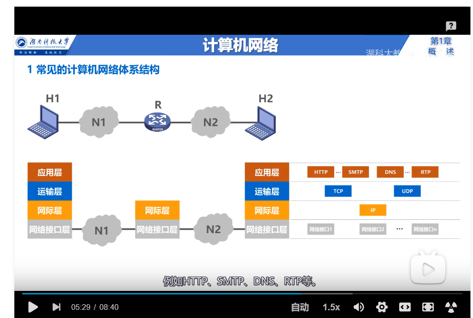
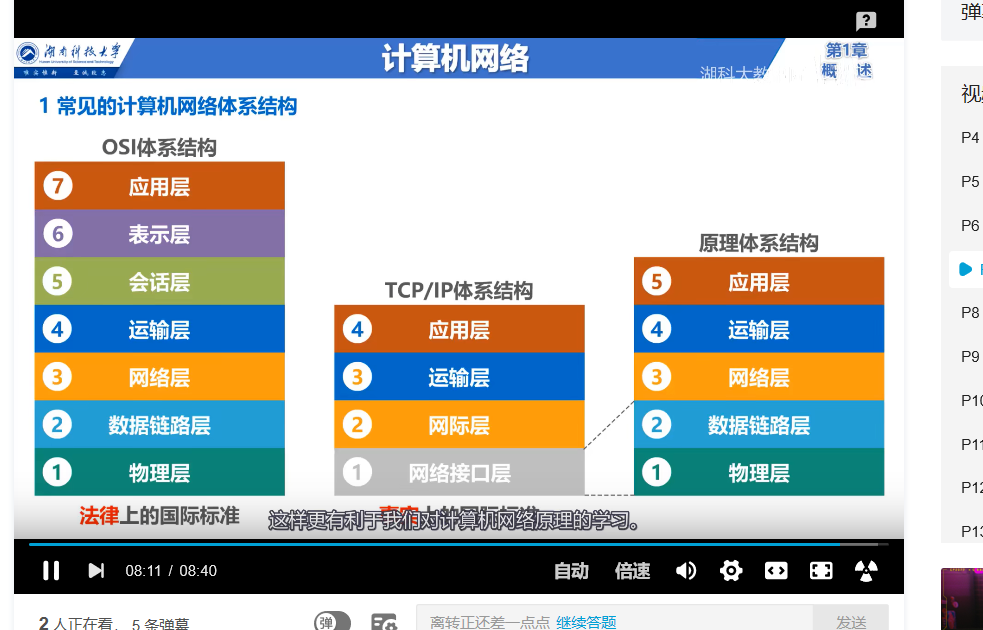
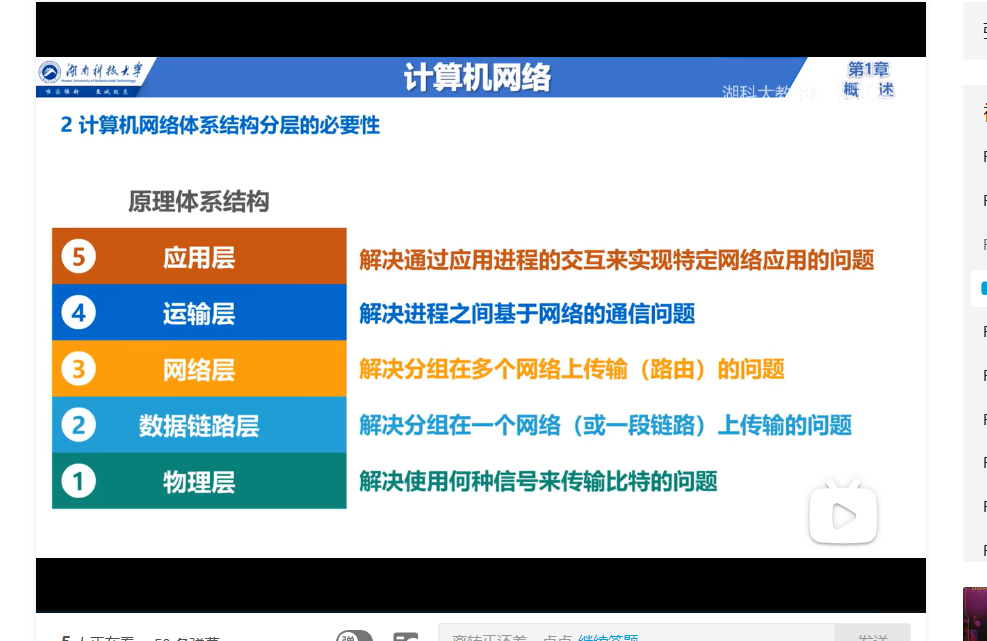
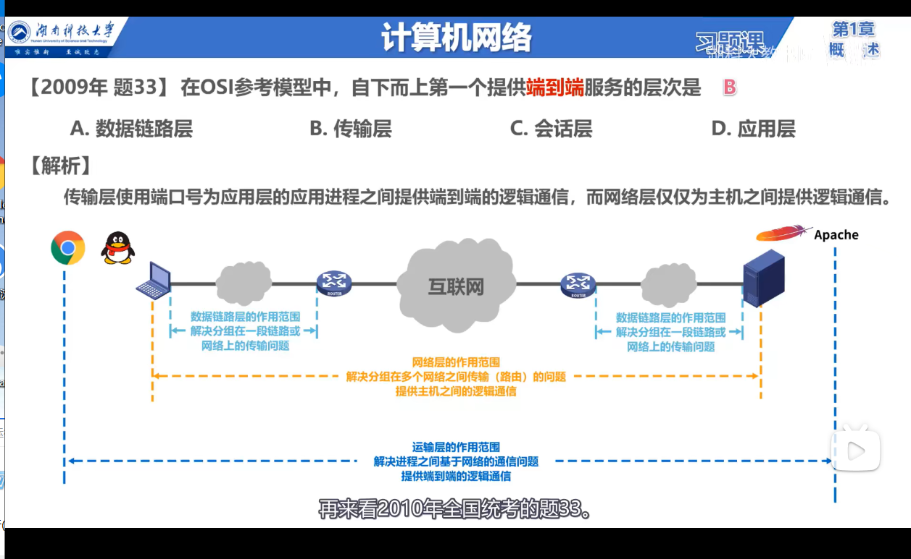
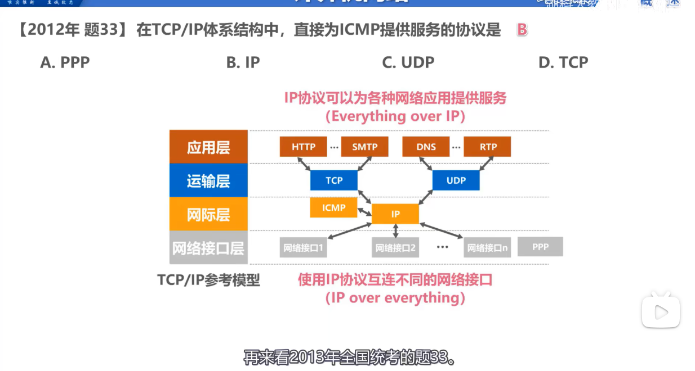
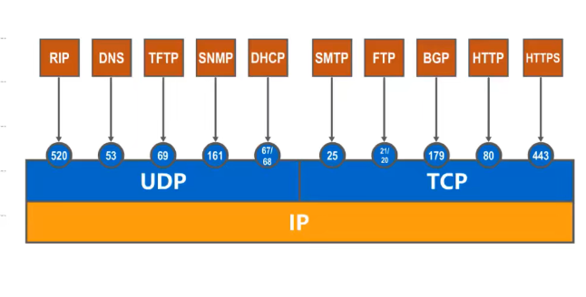
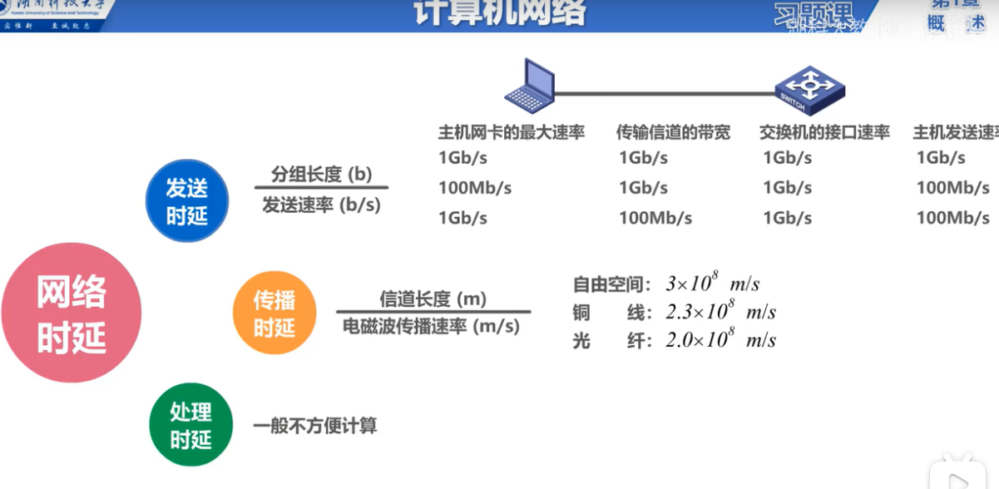
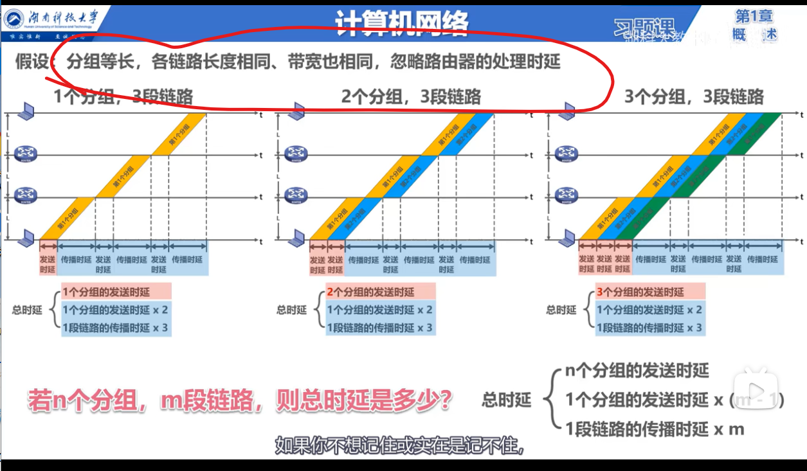
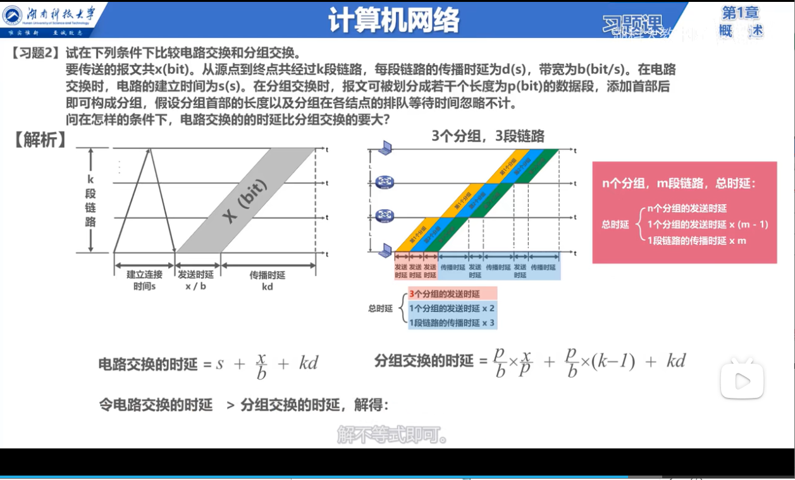

# 12.10

## 1. 常见的计算机网络体系结构

### 1.1计算机网络分层模型

### 1.2计算机网络各个层需要解决的问题

### 1.3 非常重要：举例说明各层的功能

哔哩哔哩上

[湖科大教书匠1.6](https://www.bilibili.com/video/BV1c4411d7jb?p=9)

### 1.4 术语介绍

1. 实体：可 **发送或接收信息** 的硬件或者软件进程。
2. 协议：控制两个对等实体进行逻辑通信的 **规则** 集合。
   - 语法：定义所交换信息的格式
   - 语义：定义通信双方所要完成的操作
   - 同步：定义收发双方的时序关系

### 1.5 例题

### 1.6 时延

网络时延：**发送时延（主机网卡速率，传输信道带宽，交换机接口速率），** **传播时延**，处理时延

1. 

2. 

3. 

