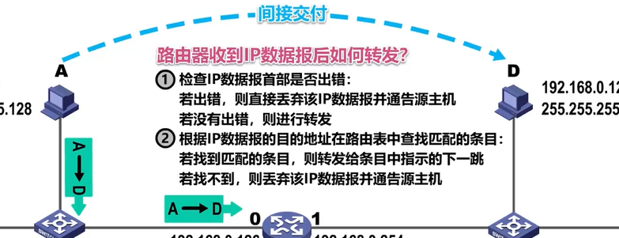

# 1013 _3 网络层

## 3.1 基本概念

网络层主要任务：

1. 网络层向运输层应该提供什么服务？可靠还是不可靠
2. 网络层寻址问题
3. 路由选择问题

## 3.2 网络层提供的两种服务

### 3.2.1 面向连接的虚电路服务

1. 核心思想是：**可靠通信应由网络自身来保证。**

### 3.2.2 无连接的数据报服务

1.核心思想：**可靠通信应该有用户主机来完成。**

对比

## 3.3 IPv4地址

### 3.3.1 IPv4地址的概述

1. IPv4地址就是给因特网上的**每一台主机和每一个接口**分配一个在全世界范围内是唯一的32比特的标识符。目前IPv4已经分配完毕，我们实际使用IPv6。
2. IPv4地址的 **点分十进制表示方法**：共32比特，每八位一组表示为一个十进制，共4个十进制数，中间用.来连接。

### 3.3.2 IPv4地址的编址方法

#### 3.3.2.1 分类编址：

1. **A类地址：**

2. **B类地址：**

   

3. **C类地址：**

**根据左起的第一个十进制的值，可以判断出ABC类地址：小于127的为A类，128~191的为B类，192~223的为C类。**

练习：

#### 3.3.2.2 划分子网的IPv4地址

   

#### 3.3.2.3 无分类编址IPv4地址

**1. 无分类域间路由选择CIDR**：消除了传统的A类，B类，C类地址以及划分子网的概念，更加有效的分配IPv4的地址空间。

**2. 路由聚合-->构造超网：**

#### 3.3.2.4 IPv4地址的应用

即将网络划分为更小的子网进行分配。

1. **定长的子网掩码FLSM：**
 

2. **变长的子网掩码VLSM**
 

## 3.4  IP数据报的发送和转发

1. 源主机如何知道目的主机是否与自己在同一个网络中呢？ 使用子网掩码进行逻辑与运算。**间接交付**：不在同一个网络中进行转发。

   

2. **默认网关：**用户为了让本网络中的主机能和其他网络中的主机进行通信，就必须给其指定本网络中的一个路由器，由该路由器帮忙进行转发。所指定的路由器也被称为默认网关。

3. 

## 3.5 静态路由配置：

路由环路问题：黑洞路由

## 3.6 路由选择协议：

